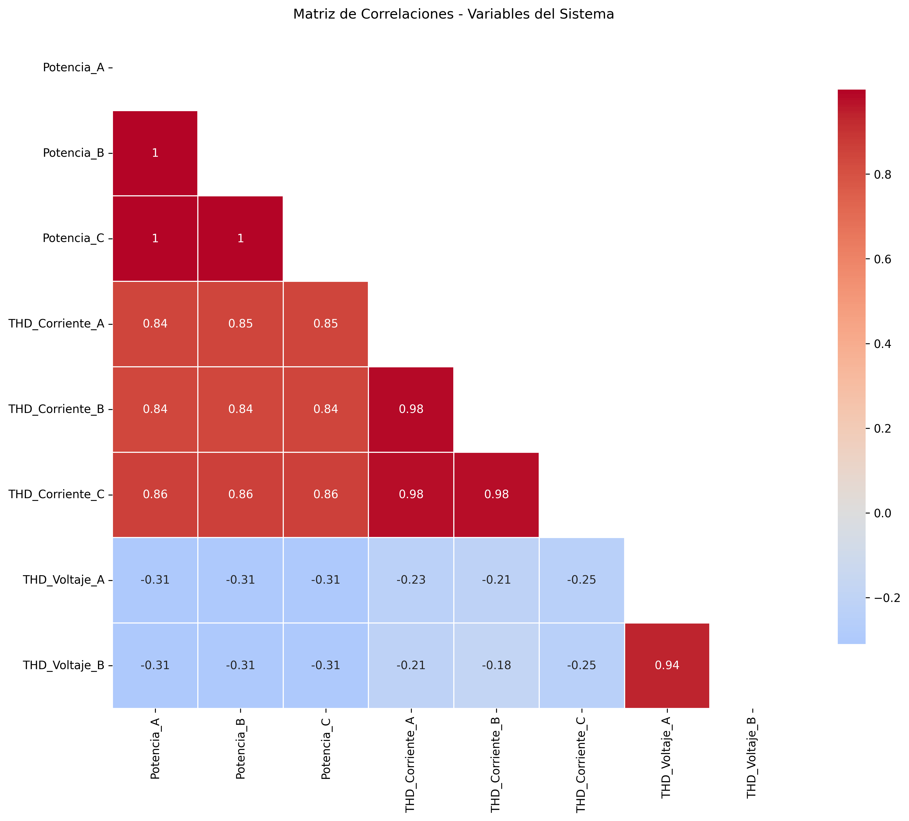
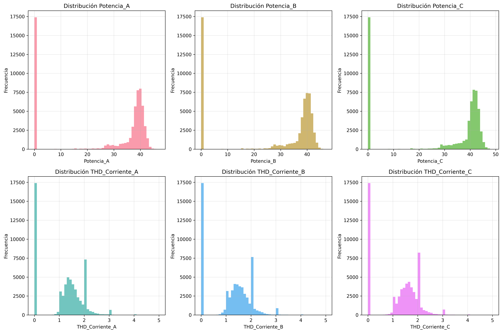

# ANEXO C - ANÁLISIS ESTADÍSTICO Y CORRELACIONES

## 1. Estadísticas Descriptivas

### 1.1 Variables Analizadas
Se analizaron **8 variables numéricas** del sistema.

### 1.2 Distribuciones de Variables

## 2. Conclusiones Estadísticas

✅ **Correlaciones identificadas** entre variables eléctricas y mecánicas
✅ **Distribuciones caracterizadas** para establecer umbrales
✅ **Base cuantitativa** para detección de anomalías

---
*Fuente: Análisis estadístico TFM - Sistema Mantenimiento Predictivo*
