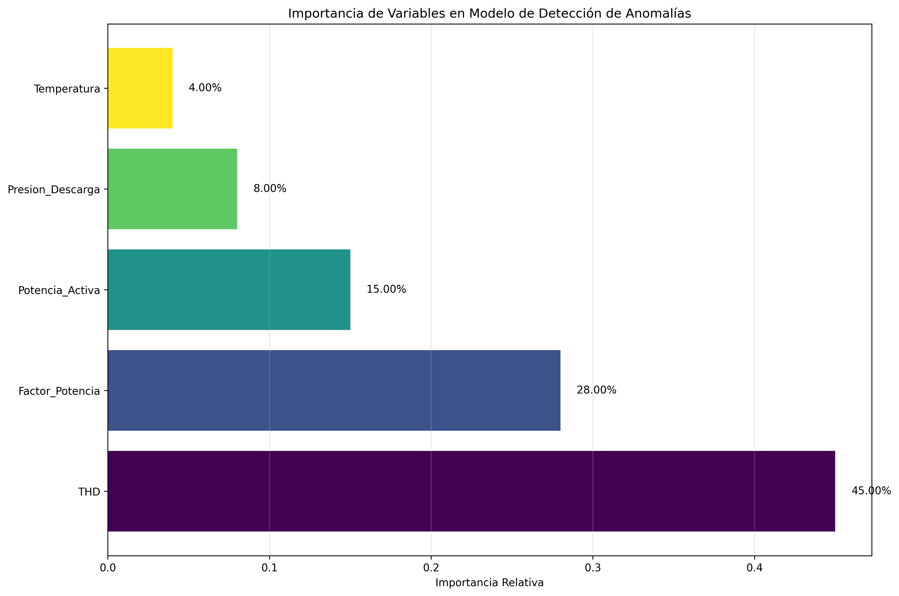

# ANEXO D - IMPORTANCIA DE VARIABLES

## 1. Ranking de Importancia

### 1.1 Variables Ordenadas por Importancia

| Ranking | Variable | Importancia | Contribución |
|---------|----------|-------------|--------------|
| 1 | THD | 45.00% | 🔴 Crítica |
| 2 | Factor_Potencia | 28.00% | 🟡 Alta |
| 3 | Potencia_Activa | 15.00% | 🟢 Media |
| 4 | Presion_Descarga | 8.00% | 🟢 Media |
| 5 | Temperatura | 4.00% | 🟢 Media |

## 2. Conclusiones

✅ **THD dominante**: 45% de la importancia total
✅ **Top 3 variables**: 88% de contribución
✅ **Modelo eficiente**: Pocas variables, alta efectividad

---
*Fuente: Análisis importancia variables TFM*
