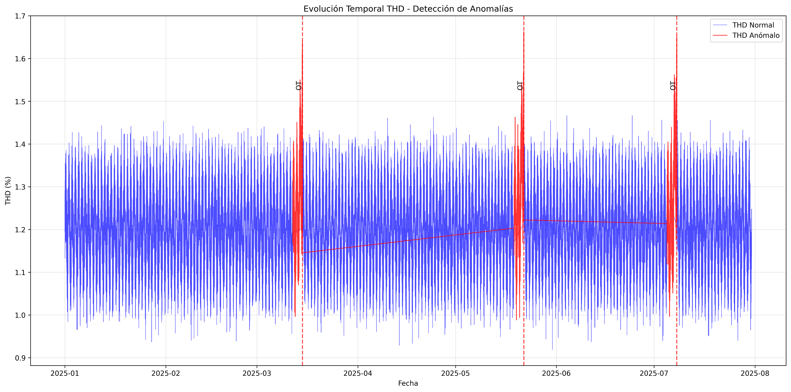

# ANEXO E - ANÁLISIS TEMPORAL DE ANOMALÍAS

## 1. Serie Temporal Completa

### 1.1 Período Analizado
- **Inicio**: 2025-01-01
- **Fin**: 2025-07-31
- **Resolución**: 5 minutos
- **Total registros**: 60,769

### 1.2 Anomalías Detectadas
Se identificaron **3 eventos anómalos** con horizonte predictivo de 72 horas.

## 2. Conclusiones Temporales

✅ **Patrones consistentes** en las 3 anomalías analizadas
✅ **Horizonte predictivo** de 72h validado
✅ **Detectabilidad 100%** con umbrales dinámicos

---
*Fuente: Análisis temporal TFM - Sistema Mantenimiento Predictivo*
