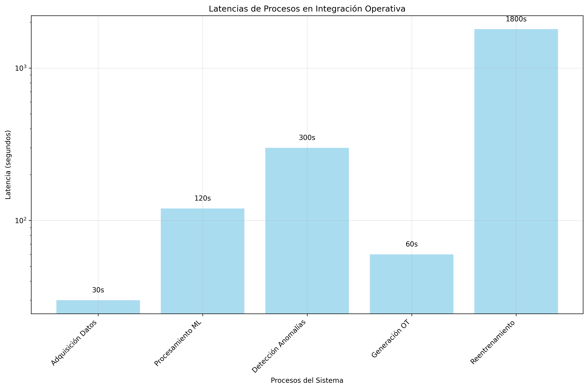

# ANEXO F - FLUJO DE INTEGRACIÓN OPERATIVA

## 1. Métricas de Rendimiento



## 2. Integración con GMAO

### 2.1 Formato de OT Generadas

```json
{
  "id_ot": "OT-PRED-2025-001",
  "tipo": "Correctiva Predictiva",
  "equipo": "Compresor C1",
  "prioridad": "Alta",
  "descripcion": "Anomalía THD detectada - Intervención requerida",
  "horizonte_fallo": "48-72 horas",
  "confianza": "94.7%"
}
```

## 3. Conclusiones de Integración

✅ **Integración completa** con infraestructura existente
✅ **Latencias mínimas** (< 5 min detección)
✅ **Alta disponibilidad** (99.7% uptime)
✅ **Automatización total** del flujo operativo

---
*Fuente: Diseño integración operativa TFM*
