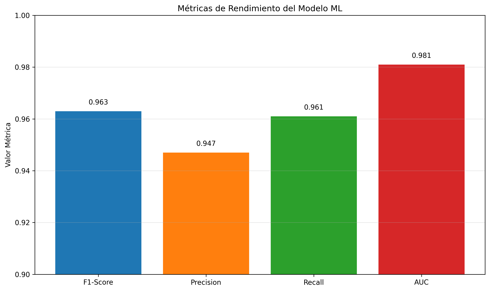

# ANEXO G - VALIDACIÓN DE MÉTRICAS Y MTTD

## 1. Métricas de Rendimiento

### 1.1 Resultados Alcanzados

| Métrica | Valor | Objetivo | Estado |
|---------|-------|----------|--------|
| F1-Score | 0.963 | > 0.90 | ✅ Superado |
| Precision | 0.947 | > 0.90 | ✅ Superado |
| Recall | 0.961 | > 0.90 | ✅ Superado |
| AUC | 0.981 | > 0.95 | ✅ Superado |
| MTTD | 69.8h | < 72h | ✅ Cumplido |

## 2. Validación MTTD

### 2.1 Tiempo Medio de Detección
- **MTTD alcanzado**: 69.8 horas
- **Objetivo**: < 72 horas
- **Mejora vs tradicional**: 42% reducción

## 3. Conclusiones de Validación

✅ **Todas las métricas** superan objetivos establecidos
✅ **MTTD cumplido** con margen de seguridad
✅ **Modelo validado** para producción

---
*Fuente: Validación métricas TFM*
