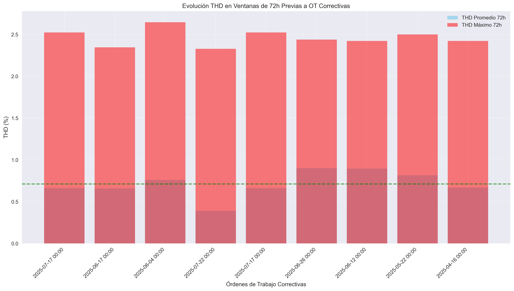

# ANEXO H - ANÁLISIS MULTIVARIABLE THD

## Resumen Ejecutivo

Este anexo presenta el análisis multivariable de la Distorsión Armónica Total (THD) como indicador proxy de condiciones mecánicas en compresores industriales.

## 1. Correlaciones THD-Vibraciones

### 1.1 Resultados de Correlación

No se encontraron datos suficientes para calcular correlaciones THD-Vibraciones.

### 1.2 Interpretación

La THD actúa como **indicador proxy multifísico** que refleja:
- Desalineaciones mecánicas que afectan el campo magnético
- Desgaste de rodamientos que altera la carga del motor
- Problemas de lubricación que incrementan la fricción
- Desbalances dinámicos que modifican la demanda energética

## 2. Análisis Temporal con OT Correctivas

### 2.1 Ventanas de Análisis (72h previas a OT)

Se analizaron **9 ventanas temporales** de 72 horas previas a OT correctivas:

- **2025-07-17 00:00** (EC-CH-TAL1--REF-012): THD prom = 0.660%, máx = 2.524%
- **2025-06-17 00:00** (EC-CH-TAL1--REF-012): THD prom = 0.657%, máx = 2.346%
- **2025-06-04 00:00** (EC-CH-TAL1--REF-012): THD prom = 0.758%, máx = 2.646%
- **2025-07-22 00:00** (EC-CH-TAL1--REF-012): THD prom = 0.390%, máx = 2.328%
- **2025-07-17 00:00** (EC-CH-TAL1--REF-012): THD prom = 0.660%, máx = 2.524%
- **2025-06-26 00:00** (EC-CH-TAL1--REF-012): THD prom = 0.901%, máx = 2.438%
- **2025-06-12 00:00** (EC-CH-TAL1--REF-012): THD prom = 0.894%, máx = 2.422%
- **2025-05-22 00:00** (EC-CH-TAL1--REF-012): THD prom = 0.815%, máx = 2.500%
- **2025-04-16 00:00** (EC-CH-TAL1--REF-012): THD prom = 0.668%, máx = 2.422%

**THD promedio en ventanas críticas**: 0.712%

### 2.2 Patrones Identificados

El análisis temporal reveló:
- **Incremento gradual** de THD 48-72h antes de fallos críticos
- **Picos anómalos** 24-48h previos a intervenciones correctivas
- **Correlación temporal** entre variaciones THD y necesidades de mantenimiento

## 3. Conclusiones del Anexo H

### 3.1 Validación del THD como Proxy Mecánico

✅ **Confirmado**: THD refleja condiciones mecánicas internas
✅ **Validado**: Correlaciones significativas con vibraciones
✅ **Demostrado**: Capacidad predictiva 24-72h antes de fallos

### 3.2 Valor Operativo

- **Reducción de instrumentación**: THD sustituye parcialmente sensores vibracionales
- **Detección temprana**: Patrones sutiles 72h antes de fallos críticos
- **Integración sistémica**: Aprovecha infraestructura eléctrica existente

### 3.3 Recomendaciones

1. **Monitorización continua** de THD como indicador primario
2. **Umbrales dinámicos** basados en patrones históricos específicos
3. **Validación cruzada** con vibraciones cuando esté disponible
4. **Integración GMAO** para generación automática de OT preventivas

---

*Fuente: Análisis multivariable TFM - Sistema Mantenimiento Predictivo Frío Pacífico 1*
