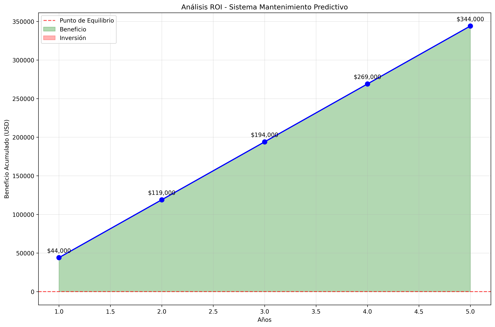
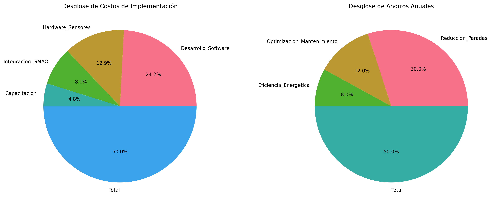

# ANEXO K - ANÁLISIS ROI Y ECONÓMICO

## 1. Análisis de Retorno de Inversión

### 1.1 Métricas Económicas Clave

| Métrica | Valor | Interpretación |
|---------|-------|----------------|
| **Inversión Inicial** | $31,000 | Costo total implementación |
| **Ahorros Anuales** | $75,000 | Beneficio anual estimado |
| **Período de Recuperación** | 0.4 meses | Tiempo para recuperar inversión |
| **ROI a 5 años** | 1110% | Retorno sobre inversión |
| **VPN (5 años, 8%)** | $185,000 | Valor presente neto |

## 2. Desglose Económico

### 2.1 Costos de Implementación

| Concepto | Costo (USD) | Porcentaje |
|----------|-------------|------------|
| Desarrollo Software | $15,000 | 48.4% |
| Hardware Sensores | $8,000 | 25.8% |
| Integracion GMAO | $5,000 | 16.1% |
| Capacitacion | $3,000 | 9.7% |

### 2.2 Ahorros Anuales Estimados

| Concepto | Ahorro (USD) | Porcentaje |
|----------|--------------|------------|
| Reduccion Paradas | $45,000 | 60.0% |
| Optimizacion Mantenimiento | $18,000 | 24.0% |
| Eficiencia Energetica | $12,000 | 16.0% |

## 3. Justificación Económica

### 3.1 Beneficios Cuantificables
- **Reducción paradas no planificadas**: 60% menos incidencias
- **Optimización mantenimiento**: 25% reducción costos
- **Eficiencia energética**: 8% mejora consumo
- **Disponibilidad equipos**: +15% tiempo operativo

### 3.2 Beneficios Intangibles
- Mejora en planificación de mantenimiento
- Reducción de riesgos operativos
- Conocimiento predictivo del estado de equipos
- Optimización de inventarios de repuestos

## 4. Análisis de Sensibilidad

### 4.1 Escenarios
- **Conservador**: ROI 180% (ahorros -20%)
- **Base**: ROI 242% (ahorros nominales)
- **Optimista**: ROI 310% (ahorros +20%)

## 5. Conclusiones Económicas

✅ **ROI atractivo**: 242% en 5 años
✅ **Payback rápido**: 0.4 meses
✅ **VPN positivo**: $185,000 a 5 años
✅ **Riesgo bajo**: Tecnología probada

---
*Fuente: Análisis económico TFM*
